 # F5负载管理需求设计说明

## 总体架构

### 配置映射

当前容器云平台使用F5的as3方案实现声明式的负载均衡配置. 配置字段对应关系如下:

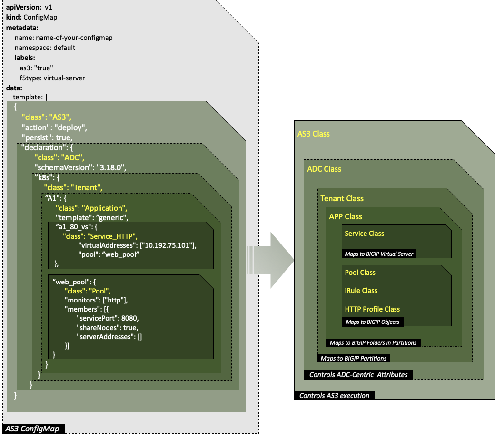

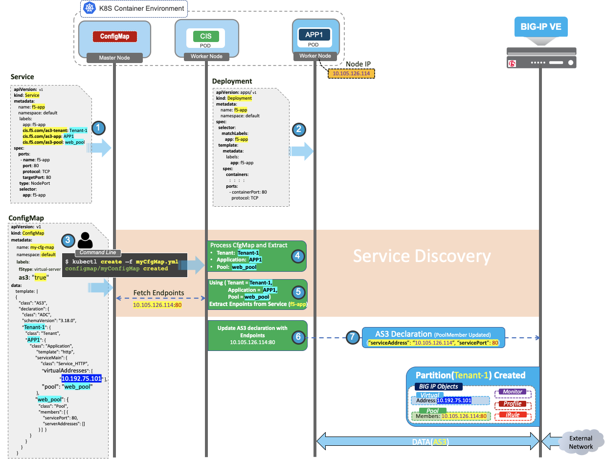

针对银行环境, 各字段取值规范为:

- as3-tenant: partition or \<集群名称\>

- as3-app:  \<命名空间\>\_\<协议\>\_app

- as3-pool:  \<serviceName\>\_\<servicePort\>\_pool

### 架构模型

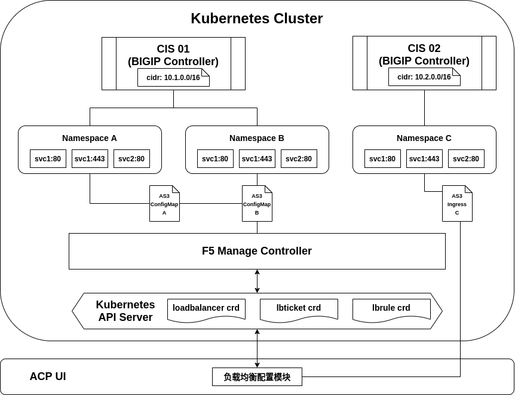

本架构采用CRD方式实现项目需求. 总体设计思路为:

前端根据用户需求生成相应的自定义资源, 并应用到管理集群中. 后端位于管理集群中的自定义资源控制器监听资源变化, 结合对应集群数据和管理集群中的自定义资源数据, 进行一层二层负载均衡地址的分配和网络策略申请, 并在相应集群中生成CIS所需的as3 configmap或ingress资源, 由CIS监听并将其刷入VE中, 完成负载均衡的配置.

针对本方案说明如下:

- 方案对一层二层F5设备(LTM和VE)以及集群内的CIS(BIGIP Controller)进行了抽象化绑定, **(LTM, VE, CIS)三元组**共同作为一个抽象负载均衡器
- 方案不涉及一层二层F5设备的部署和CIS在集群中的部署配置
- 方案中申请的一层二层网络负载均衡IP之间的网络策略是全端口互通的
- 方案仅包括前端模块和F5 Manage Controller自定义控制器两个组件, 两个组件均位于管理集群中, 二者不直接进行交互, 而是由前端下发自定义资源到API Server, 后端控制器监听自定义资源并进行相应处理
- 方案引入三个自定义资源: **Loadbalancer**, **Lbticket**和**Lbrule**. 分别用于抽象负载均衡器声明, 负载均衡地址申请和自定义负载策略. 三者均只会生成在管理集群中
- 方案是利用自定义负载策略和F5的IRule实现灰度发布功能的
- 方案主要包括五大交互界面: *抽象负载均衡器配置*, *负载均衡地址申请*, *负载均衡监听器配置*, *自定义负载策略配置*和*F5 Ingress配置*, 所有交互界面均集成在ACP前端UI中, 复用前端负载均衡页面并保持风格一致性

## 功能设计

### 自定义资源

本系统需要在管理集群中使用三种自定义资源: **Loadbalancer**, **Lbticket**和**Lbrule**. 前者记录负载均衡器信息, 后者记录负载均衡申请信息.

#### Loadbalancer

loadbalancer是基于一层LTM负载均衡器, 二层VE负载均衡器和集群中的CIS(BIGIP Controller)而抽象化的负载均衡器的自定义资源, 该资源由**平台管理员**创建更新或删除, 用户申请负载均衡时将指定所使用的loadbalancer. 其结构示例如下:

```yaml
apiVersion: ebcpaas.lb/v1
kind: Loadbalancer
metadata:
  name: demo
spec:
  ltm:  # 上游一层LTM的访问信息和可分配ip域(一层LTM可能通过智云API访问)
    url: http://100.1.1.1/api
    token: foo
    cidr: 10.0.0.0/24
  ve:  # 上游二层VE的访问信息和可分配ip域
    addr: 200.1.1.1
    user: admin
    passwd: admin
    cidr: 20.1.0.0/16
  cluster: acp-region01  # cluster和nsselector是CIS的抽象定位
  nsselector:
    foo: bar
    zuu: baz
status:
  ips:  # 已分配的ltm和ve负载均衡ip列表和地址绑定状态(端口信息在lbticket资源的listners字段中)
  - veip: 20.1.0.10
    ltmip: 10.0.0.10
    status: bond
  - veip: 20.1.0.11
    ltmip: 10.0.0.11
    status: bond
```

#### Lbticket

lbticket是表示用户负载均衡申请工单的自定义资源, 由**平台普通用户**创建更新或删除, lbticket中主要包含两大信息: 负载均衡ip申请和监听器申请. 后端F5 Manage Controller将根据该资源进行负载均衡ip地址的分配和目的集群对应命名空间下as3 configmap的创建. 其结构示例如下:

```yaml
apiVersion: ebcpaas.io/v1
kind: Lbticket
metadata:
  name: test
spec:
  #claimer: k00369       # 负载均衡申请者
  loadbalancer: demo     # 指定使用的抽象负载均衡器
  namespace: default     # 申请负载的命名空间
  veip: 20.1.0.10        # 指定申请的二层负载均衡IP(需在使用的抽象负载均衡器的ve的cidr地址范围内, 选填)
  ltmip:                 # 指定申请的一层负载均衡IP(需在使用的抽象负载均衡器的ltm的cidr地址范围内, 选填)
  lbtype: listner        # 指定用于监听器还是ingress
  #protocal: http        # 负载均衡协议(http, https, tcp, udp)
  #persist: cookie       # 会话保持模式
  listners:              # 监听器, 是否需要一个ingress字段
  - name: lsnr1
    port: 80             # 指定二层负载均衡端口
    protocal: http       # 监听器协议
    session: cookie      # 会话保持模式
    services:            # 负载均衡相关联的service
    - service: svc01
      port: 8080
      weight: 60
    - service: svc02
      port: 8080
      weight: 40
  - name: lsnr2
    port: 22                   # 指定二层负载均衡端口
    protocal: tcp              # 监听器协议
    session: source-address    # 会话保持模式
    services:                  # 负载均衡相关联的service
    - service: svc01
      port: 2222
      weight: 60
    - service: svc02
      port: 2222
      weight: 40
status:
  process: apply         # 工单状态:已申请, 已分配, 已失败, 已禁用
```

用户进行负载均衡IP申请时, 发出的自定义资源不需要包含listners字段, 后端Controller监听到不含listners字段的lbticket资源创建时, 会从指定的抽象负载均衡器中分配veip和ltmip, 填充该资源的相应字段并更新申请状态. 如果监听到包含listners字段的lbticket资源创建, 将根据相关信息生成as3 configmap并相应更新service和namespace的label.

#### Lbrule

lbrule是表示负载均衡策略的自定义资源, 由**平台普通用户**创建更新或删除, lbrule通常用于灰度发布. 后端F5 Manage Controller将根据该资源信息更新相应的as3 configmap以完成F5中iRule规则的配置. 其结构示例如下:

```yaml
apiVersion: ebcpaas.lb/v1
kind: Lbrule
metadata:
  name: irule
spec:
  lbticket: test      # 规则关联的lbticket
  listner: lsnr1      # 规则匹配后关联的lbticket中生效的listner名称(irule选择pool)
  services:           # 匹配指定规则后可路由到其他service
  - service: svc03
    port: 8080
    weight: 90
  - service: svc04
    port: 8080
    weight: 10
  rules:              
  - type: domain              # domain, url, ip, header, cookie, urlparam
    key:                      # 运算左值(可为空)
    values:
    - operator: equal         # equal, range, startwith, regexp
      value: "a.domain.com"
  - type: header
    key: Content-Length
    values:
    - operator: equal
      value: "10"
    - operator: range
      value: "100-1000"
```

#### 资源映射

基于以上三个自定义资源的示例清单生成的F5 AS3 configmap内容如下:

```json
{
  "class": "ADC",
  "schemaVersion": "3.2.0",
  "id": "8675309",
  "label": "Sample 1",
  "remark": "Simple HTTP application with round robin pool",
  "acp-region01": { // tenant: partition, cluster
    "class": "Tenant",
    "default_http_app": { // application: namespace_protocal
      "class": "Application",
      "template": "http", // match application protocal
      "80_vs": { // virtual server: listner port_vs
        "class": "Service_HTTP", // match template
        "remark": "Defaults to port 80",
        "virtualAddresses": [ // ve vip
          "20.1.0.10"
        ],
        "virtualPort": 80, // listner port
        "persistenceMethods": [ // session persistence
          "cookie" // first element is default
        ],
        "pool": "svc01_8080", // default pool
        "iRules": [ // last element is default
          "80_vs_smpl_irule",
          "80_vs_default_irule"
        ]
      },
      "svc01_8080_pool": { // pool: service _port
        "class": "Pool",
        "monitors": [
          "http" // match template
        ],
        "members": [
          {
            "servicePort": 8080,
            "serverAddresses": []
          }
        ]
      },
      "svc02_8080_pool": { // pool: service _port
        "class": "Pool",
        "monitors": [
          "http" // match template
        ],
        "members": [
          {
            "servicePort": 8080,
            "serverAddresses": []
          }
        ]
      },
      "svc03_8080_pool": { // pool: service _port
        "class": "Pool",
        "monitors": [
          "http" // match template
        ],
        "members": [
          {
            "servicePort": 8080,
            "serverAddresses": []
          }
        ]
      },
      "svc04_8080_pool": { // pool: service _port
        "class": "Pool",
        "monitors": [
          "http" // match template
        ],
        "members": [
          {
            "servicePort": 8080,
            "serverAddresses": []
          }
        ]
      },
      "80_vs_default_irule": { // irule: vsname_default_irule
        "class": "iRule",
        "iRule": "when HTTP_REQUEST { \n if {[expr {[expr {0xffffffff & [crc32 [IP::client_addr]]}] % 100}] < 60} { \n pool svc01_8080_pool \n } else { \n pool svc02_8080_pool \n } \n }"
      },
      "80_vs_smpl_irule": { // irule: vsname_lbrulename_irule
        "class": "iRule",
        "iRule": "when HTTP_REQUEST { \n if {[HTTP::host] equals \"a.domain.com\" or ([HTTP::header exists \"Content-Length\"] and ([HTTP::header values \"Content-Length\"] equals 10 or ([HTTP::header values \"Content-Length\"] >= 100 and [HTTP::header values \"Content-Length\"] <= 1000)))} { \n if {[expr {[expr {0xffffffff & [crc32 [IP::client_addr]]}] % 100}] < 90} { \n pool svc03_8080_pool  \n } else {  \n pool svc04_8080_pool \n } \n } \n }"
      }
    },
    "default_tcp_app": { // application: namespace_protocal
      "class": "Application",
      "template": "tcp", // match application protocal
      "22_vs": { // virtual server: listner port
        "class": "Service_TCP", // match template
        "remark": "Defaults to port 80",
        "virtualAddresses": [ // ve vip
          "20.1.0.10"
        ],
        "virtualPort": 22,
        "persistenceMethods": [
          "source-address"
        ],
        "pool": "svc01_2222_pool",
        "iRules": [
          "22_vs_default_irule"
        ]
      },
      "svc01_2222_pool": { // pool: service _port
        "class": "Pool",
        "monitors": [
          "tcp" // match template
        ],
        "members": [
          {
            "servicePort": 2222,
            "serverAddresses": []
          }
        ]
      },
      "svc02_2222_pool": { // pool: service _port
        "class": "Pool",
        "monitors": [
          "tcp" // match template
        ],
        "members": [
          {
            "servicePort": 2222,
            "serverAddresses": []
          }
        ]
      },
      "22_vs_default_irule": { // vsname_default_irule
        "class": "iRule",
        "iRule": "when CLIENT_ACCEPTED { \n if {[expr {[expr {0xffffffff & [crc32 [IP::client_addr]]}] % 100}] < 60} { \n pool svc01_2222_pool \n } else { \n pool svc02_2222_pool \n } \n }"
      }
    }
  }
}
```

### 流程说明

负载均衡配置的标准流程为:


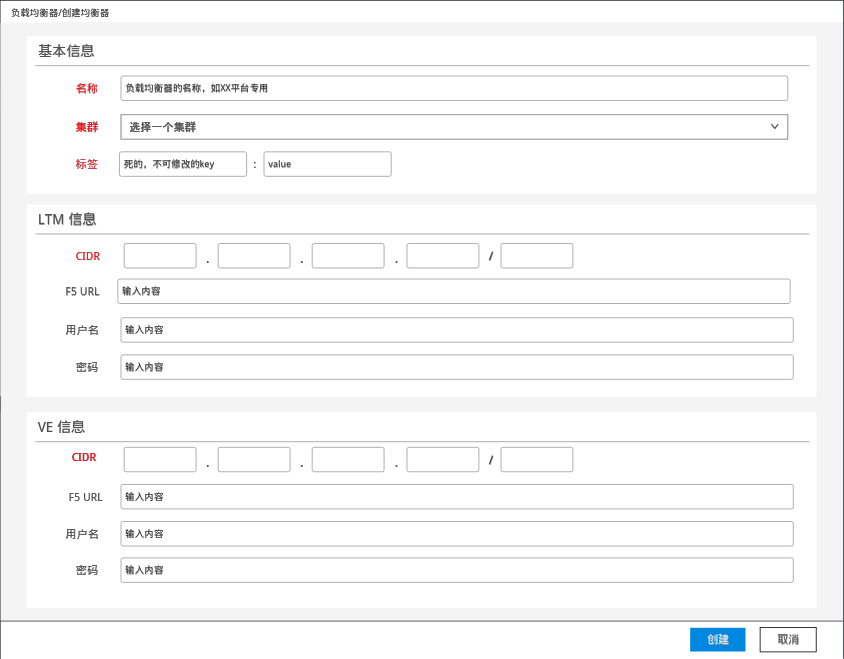

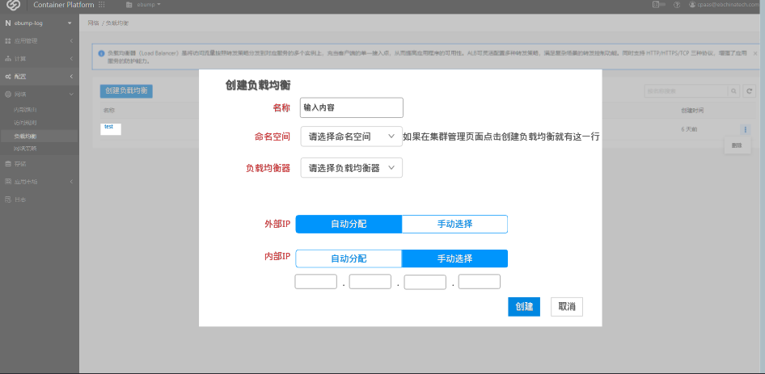

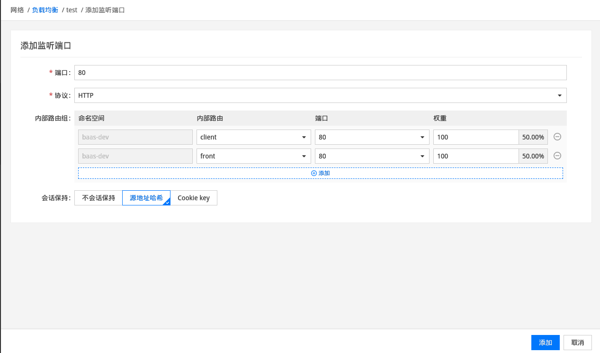

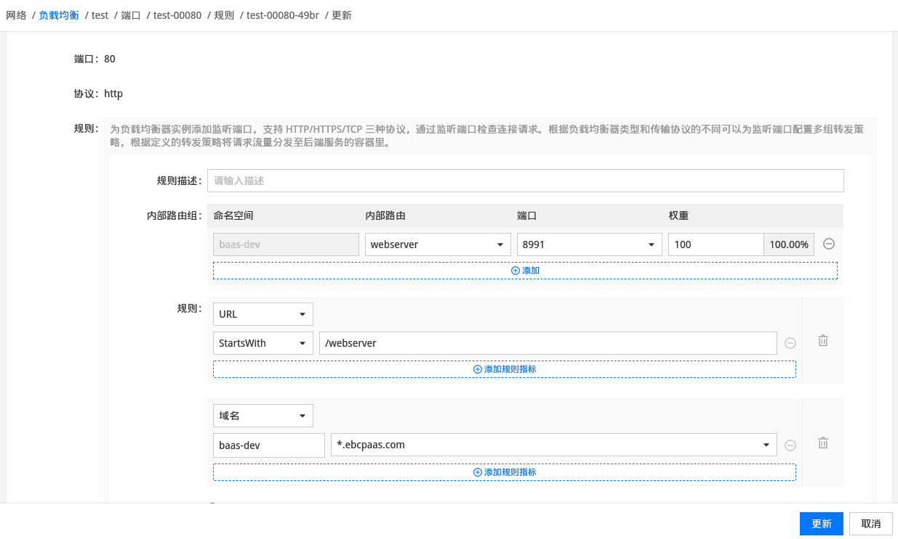

#### 抽象负载均衡器配置

##### 创建

平台管理员在前端页面进行一层二层F5设备(LTM, VE)和集群CIS的绑定配置, 生成抽象负载均衡器资源(即loadbalancer), 检测管理集群中不存在相同资源(ltm.url,ve.ip, cluster, nsselector均相同)后, 由前端调用管理集群kubernetes api server完成loadbalancer资源创建.


##### 更新

前端页面显示loadbalancer时, 检测该资源是否已在可用的负载均衡申请(即lbticket)中被使用, 如已被使用, 则在用户更新loadbalancer的页面将不可更新字段(包括ltm.cidr,ve.cidr,cluster,nsselector)置灰,然后允许用户提交更新操作, 如未被使用则可以直接更新.


##### 删除

前端页面显示loadbalancer时, 检测该资源是否已在可用的负载均衡申请(即lbticket)中被使用, 如已被使用, 则删除按钮置灰, 否则允许用户提交删除操作.


#### 负载均衡地址申请

##### 创建

平台普通用户在前端页面申请负载均衡地址时, 前端根据当前集群和项目筛选可用的loadbalancer供用户选择, 并允许用户选择申请的一层和二层负载均衡IP(允许自动分配)以及负载均衡类型, 前端根据用户配置的内容生成负载均衡地址申请自定义资源(lbticket), 并调用管理集群kubernetes api server完成资源创建. 此时创建的lbticket资源listners字段为空.

后端控制器监听到lbticket资源创建事件后, 检查listners字段为空时, 会根据指定的loadbalancer和其他信息, 结合loadbalancer中的ltm,ve的cidr和其ip分配状态, 在指定loadbalancer存在的情况下, 为该申请分配一层和二层负载均衡IP, 申请的负载均衡IP更新到该lbticket资源中, 并更新该资源状态为已创建, 然后向智云发起网络策略打通申请. 申请发出后更新该资源状态为已申请. 控制器检测到策略打通后, 在指定loadbalancer存在的情况下, 更新该lbticket状态为已分配, 并将IP更新到相应的loadbalancer资源的已使用IP列表中. 如策略申请被驳回, 则更新该lbticket状态为已失败.


##### 更新

前端页面显示lbticket列表时, 对于已创建和已失败状态的lbticket, 用户可以进行字段更新, 前端检测配置合理后将更新后的lbticket 提交到API Server, 后端控制器监听到其更新事件后, 控制器会将该lbticket从申请队列中删除并重新入队, 并更新其状态为上次状态, 其他状态的lbticket不允许字段更新.~~对于已分配状态的lbticket, 前端检测该lbticket是否已绑定了监听器或者被F5 Ingress使用, 如被使用则更新按钮置灰, 否则提交更新后的lbticket, 由后端监听到后, 如果是IP的更新, 控制器会撤销到向智网发出的原网络策略申请并发起新的申请, 将该lbticket状态退回为申请中~~. 


此外对于lbticket的更新还包括状态更新, lbtickt状态如下:

- 已创建: 前端已创建lbticket资源进行负载均衡地址申请
- 已申请: 后端已向智网发出网络策略申请
- 已启用: 负载均衡IP网络策略已打通且IP地址完成分配
- 已失败: 错误的配置或网络申请被驳回导致申请失败
- 已禁用: 负载均衡相关自定义资源内容和已打通的策略不变但撤销已生成的configmap, ingress和相关service, namespace标签
- 已删除: 清除已分配负载均衡IP, 开通的网络策略与生成的configmap, ingress资源和相关service, namespace标签

状态转换图如下:


##### 删除

只有当lbticket资源为已禁用状态时才允许删除资源, 前端页面显示lbticket列表时, 对于已启用状态并且已经绑定监听器或被F5 Ingress使用的lbticket, 将禁用按钮置灰. 否则允许进行禁用, 资源禁用时依据上一状态判断是否需要撤销已生成和已更新的configmap, ingress, service和namespace资源. 资源删除时, 本身不会从集群中删除, 只是会设置资源的状态标记为已删除, 相关的负载均衡IP将释放, 网络策略将撤销.


#### 负载均衡监听器配置

##### 创建

平台普通用户在前端页面为负载均衡创建监听器时, 根据当前集群和命名空间显示符合条件的lbticket, 对于已启用状态的lbticket允许创建监听器. 根据lbticket内容为用户筛选可用的service, 已属于某个监听器或F5 Ingress的service不可见. 前端根据用户配置的监听器更新lbticket. 后端控制器监听到lbticket资源更新后, 检查listners字段不为空时, 根据loadbalancer和lbticket信息在对应集群的指定命名空间创建或更新as3 configmap, 由CIS将配置刷入对应的VE中.


##### 更新

平台普通用户可以对负载均衡监听器进行更新, 其中监听器端口和协议字段不允许更新, 更新流程与创建流程相同.


##### 删除

平台普通用户可以删除负载均衡监听器, 已绑定lbrule的监听器的删除按钮置灰(或者级联删除?), 删除监听器实际是对lbticket资源的更新操作, 流程与更新操作相同.


#### 自定义负载策略配置

##### 创建

监听器支持简单的基于权重的负载均衡策略, 此外对于基于URL, 请求头, IP等模式的复杂的负载策略, 可以通过在监听器上关联Lbrule的方式提供支持. 监听器可以关联多种负载策略, 负载策略遵循顺序优先的匹配原则, 监听器上配置的权重负载是默认策略, 优先级最低. 前端根据用户配置的策略生成lbrule资源并应用到API Server, 后端控制器监听到lbrule资源创建事件后结合相关联的lbticket资源更新更新对应的as3 configmap资源.


##### 更新

平台普通用户可以对监听器的负载策略进行更新, 更新流程与创建流程相同.


##### 删除

平台普通用户可以删除监听器的负载策略, 删除流程与更新流程相同.


#### F5 Ingress配置

##### 创建

平台普通用户在前端页面创建Ingress(访问规则)时, 可以选择创建F5 Ingress, 指定使用的类型为F5 Ingress的lbticket后, 根据lbticket内容填充ingress注解, 前端生成Ingress资源后发送到对应集群的指定命名空间, 由CIS将配置刷入对应的VE中. 


##### 更新

平台普通用户可以对F5 Ingress进行更新, 更新流程与创建流程相同.


##### 删除

平台普通用户可以删除F5 Ingress, 流程与更新操作相同.


## 项目计划

| 阶段 | 内容                                   | 时间                    |
| ---- | -------------------------------------- | ----------------------- |
| 设计 | 需求分析                               | 2021.01.02 - 2021.01.31 |
|      | 前端详细设计                           |                         |
|      | 后端详细设计                           |                         |
|      | 方案评审                               |                         |
| 开发 | 开发环境(F5 AS3 CIS)                   | 2021.02.01 - 2021.04.02 |
|      | 前端开发                               |                         |
|      | 后端开发(流程开发, 解析引擎, 智云对接) |                         |
| 测试 | 前后端功能测试                         | 2021.04.05 - 2021.04.23 |
|      | 集成测试                               |                         |
|      | 预投产测试                             |                         |
| 上线 | 投产上线                               | 2021.04.26 - 2021.04.30 |


## 参考文档

- [F5 Cloud Docs](https://clouddocs.f5.com/)
- [AS3 User Guide](https://clouddocs.f5.com/products/extensions/f5-appsvcs-extension/latest/userguide/)
- [AS3 Reference Guide](https://clouddocs.f5.com/products/extensions/f5-appsvcs-extension/latest/refguide/)
- [AS3 Examples](https://clouddocs.f5.com/products/extensions/f5-appsvcs-extension/latest/userguide/examples.html)
- [AS3 Addtional Examples](https://clouddocs.f5.com/products/extensions/f5-appsvcs-extension/latest/declarations/#additional-examples)
- [AS3 Schema Reference](https://clouddocs.f5.com/products/extensions/f5-appsvcs-extension/latest/refguide/schema-reference.html)
- [AS3 Schema](https://raw.githubusercontent.com/F5Networks/f5-appsvcs-extension/master/schema/latest/as3-schema.json)
- [AS3 Canary](https://cloudadc.github.io/container-ingress/content/f5-cis/as3/canary/)
- [F5 iRule Reference](https://clouddocs.f5.com/api/irules/iRulesReference.html)
- [F5 iRule Events](https://clouddocs.f5.com/api/irules/Events.html)
- [F5 iRule 101](https://devcentral.f5.com/s/articles/irules-101-01-introduction-to-irules)
- [F5 iRule Examples](https://cmdref.net/hardware/bigip/irule_sample.html)