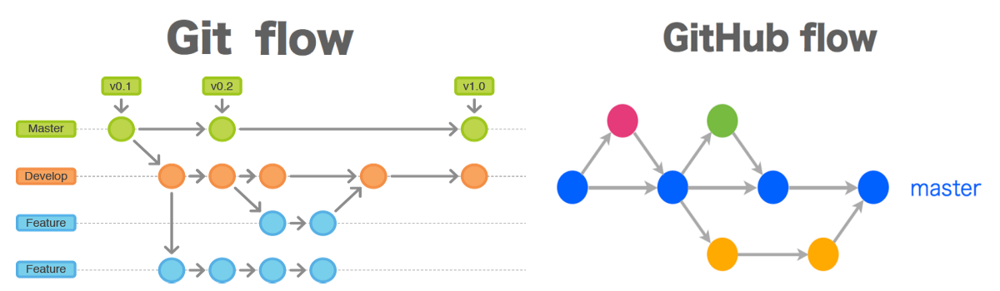
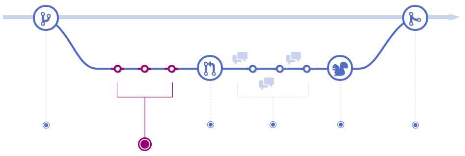
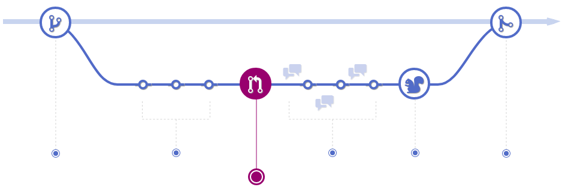
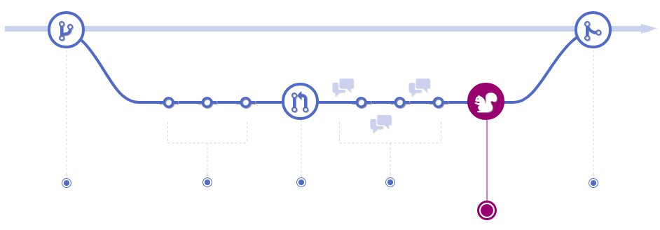
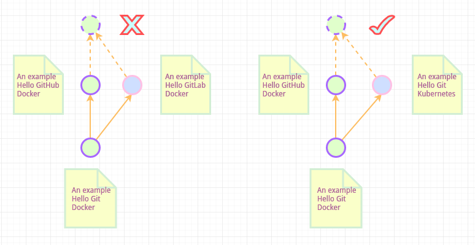
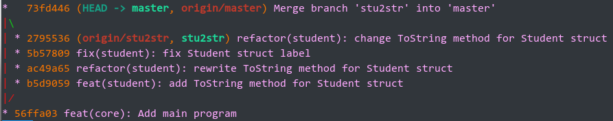
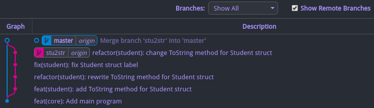

<style scoped>span { color: #bb7; }</style>
<style scoped> { color: #abc; }</style>
# <!-- fit --> 基于Git的项目开发规范

<br>
<br>

### &nbsp; &nbsp;  &nbsp; &nbsp; &nbsp; &nbsp; &nbsp; &nbsp; &nbsp; &nbsp; &nbsp; &nbsp; &nbsp; &nbsp; &nbsp; &nbsp; &nbsp; &nbsp; &nbsp; &nbsp; &nbsp; &nbsp;  &nbsp; &nbsp; &nbsp; &nbsp; &nbsp; &nbsp; &nbsp; &nbsp; &nbsp; &nbsp; &nbsp; &nbsp; &nbsp; &nbsp; &nbsp; &nbsp; &nbsp; &nbsp; &nbsp; 智能云计算 &nbsp; 陈盼

### &nbsp; &nbsp;  &nbsp; &nbsp; &nbsp; &nbsp; &nbsp; &nbsp; &nbsp; &nbsp; &nbsp; &nbsp; &nbsp; &nbsp; &nbsp; &nbsp; &nbsp; &nbsp; &nbsp; &nbsp; &nbsp; &nbsp;  &nbsp; &nbsp; &nbsp; &nbsp; &nbsp; &nbsp; &nbsp; &nbsp; &nbsp; &nbsp; &nbsp; &nbsp; &nbsp; &nbsp; &nbsp; &nbsp; &nbsp; &nbsp; &nbsp; &nbsp; &nbsp; &nbsp; &nbsp; &nbsp; 2019.09.27

---

# [GIT相关](https://git-scm.com/book/zh/v2)

<br>

###### **☑ Git: 开源分布式版本控制系统**

###### **☑ GitHub: 基于Git的面向开源及私有软件项目的公共托管平台**

###### **☑ GitLab: 基于Git的私有软件项目托管平台和DevOps生命周期管理工具**


---

# **工作流** - 选型



###### GitHub Flow: 基于分支的轻量级工作流, 非常适合小团队代码快速频繁迭代和部署

---

# **工作流** - 创建分支


###### 基于master分支开辟新分支, 在新分支上进行开发工作, 保持master分支持续可用

---

# **工作流** - 提交代码



###### 在新分支上, 无论何时添加, 编辑或删除一个文件, 都应当进行一次代码提交(commit), 并按照规范填写提交说明(commit message), 以便跟踪工作进展, 记录提交目的, 方便回滚

---

# **工作流** - 发起PR



###### 新分支上完成阶段性开发后, 通过发起Pull Request请求将新分支合并到master分支

---

# **工作流** - 讨论审核


###### 代码审核人员, 项目其他协作者参与讨论, 提出问题和建议. PR发起者根据讨论和反馈, 继续提交代码进行修复和完善

---

# **工作流** - 部署验证



###### 对PR代码进行集成和部署, 验证生产环境下的可用性, 这一步骤通常在发起PR时通过流水线自动触发进行验证

---

# **工作流** - 合并提交


###### 一切审核与验证程序就绪后, 审核人员即可将Pull Request的分支内容合并到master分支

---

# **分支合并** - 合并方式

**✤ merge**:
  - `merge --ff`: 快进式合并
  - `merge --no-ff`: 非快进式合并
  - `merge --squash`: 压缩合并

**✤ rebase**: 变基(重放合并)


---

# **分支合并** - 冲突问题

> **❀ 合并是三方关系**
> **❀ git比较与合并工具: beyond compare 4 | meld**

<br>



---

# **分支合并** - 提交记录

> **git log --oneline --graph --decorate**





---

# **提交说明** - 规范化

> git commit -m "feat(core): add new feature"

### Angular规范

```html
<type>(<scope>): <subject>   // Header(必填)
// 空一行
<body>                       // Body(选填)
// 空一行
<footer>                     // Footer(选填)
```

### 我们的规范

<style scoped>a { color: #eee; }</style>

```html
<type>(<scope>): <subject>   // Summary(必填)
// 空一行
<detail>                     // Detail(选填)
```

---

<style scoped>p { color: #aaa; }</style>
# **提交说明** - 字段解释

```
<type>(<scope>): <subject>
```

### ◊ type(必填): 说明提交的类别

- **feat**: 新增功能特性(feature)
- **fix**: 修补bug
- **refactor**: 代码重构(非新增和bug修补的代码变更)
- **docs**: 文档相关
- **style**: 格式相关(不涉及代码运行的内容变更)
- **test**: 测试相关
- **chore**: 构建过程或辅助工具的变更

---

# **提交说明** - 字段解释

```
<type>(<scope>): <subject>
```

### ◊ scope(选填): 说明提交影响的范围或模块, 依项目而异

### ◊ subject(必填): 关于提交的简短说明
1. 以动词开头, 使用第一人称现在时, 如change, 而不是changed或changes
2. 第一个字母小写
3. 结尾不加符号(如句号分号等)

<br>

```
<detail>
```

> **<detail>**

### ◊ detail(选填): 关于提交的详细描述, 可以是复杂的markdown格式

---

# **提交说明** - 示例

```bash
git commit -m "fix(controller): fix #2 @xshrim"
```

``` json
docs(document): summarize changes in around 50 characters or less


More detailed explanatory text, if necessary.

Explain the problem that this commit is solving.

Further paragraphs come after blank lines.

 - Bullet points are okay.

If you use an issue tracker, put references to them at the bottom:

Closes: #123
See also: #456, #789
```

---

# **提交说明** - 工具

### ❖ [gommit](https://github.com/antham/gommit)

> 基于golang开源的小巧灵活的commit message语法检查工具

- **语法检查**: 支持检查message, commit的message或范围内所有message
- **自定义规则**: 正则表达式方式自定义commit message语法规则
- **git hook**: 基于git hook机制自动强制规则检查

### ❖ [git-chglog](https://github.com/git-chglog/git-chglog)

> 基于golang开源的markdown格式changelog自动生成工具

- **主流规则与模板支持**: 原生支持主流的commit message规则和changelog文档模板
- **自定义配置**:  支持自定义commit message规则和文档生成规则
- **自定义模板**: 支持自定义changelog的生成模板(text/template)

---

# **变更记录** - 说明

##### ☞ 描述

> **变更记录(changelog)** 是一个包含按计划和时间顺序排列的项目的每个版本的显著更改列表的文件

##### ☞ 作用

> 使**产品用户**和**项目贡献者**更容易准确的看到项目的每个发行版之间进行了哪些显著更改以及下个版本可能的更新内容

##### ☞ 类型

> 变更类型, 即commit message的subject部分的**第一个单词(动词)**, 如:
> add(新功能), change(更改现有功能), deprecate(即将移除的功能), remove(已经移除的功能), fix(修复bug)等等, **此字段不强制**

---

# **变更记录** - 原则

###### ✧ 变更日志适用于人类而不适用于机器

###### ✧ 每个单独的版本都应该有一个条目

###### ✧ 相同类型的更改应分组

###### ✧ 版本和部分应可链接

###### ✧ 最新版本优先

###### ✧ 显示每个版本的发行日期

###### ✧ 提及是否遵循语义版本控制

---

# **变更记录** - 示例


---

<style scoped>span { color: #aaa; }</style>
# <!-- fit --> O(∩_∩)O谢谢
