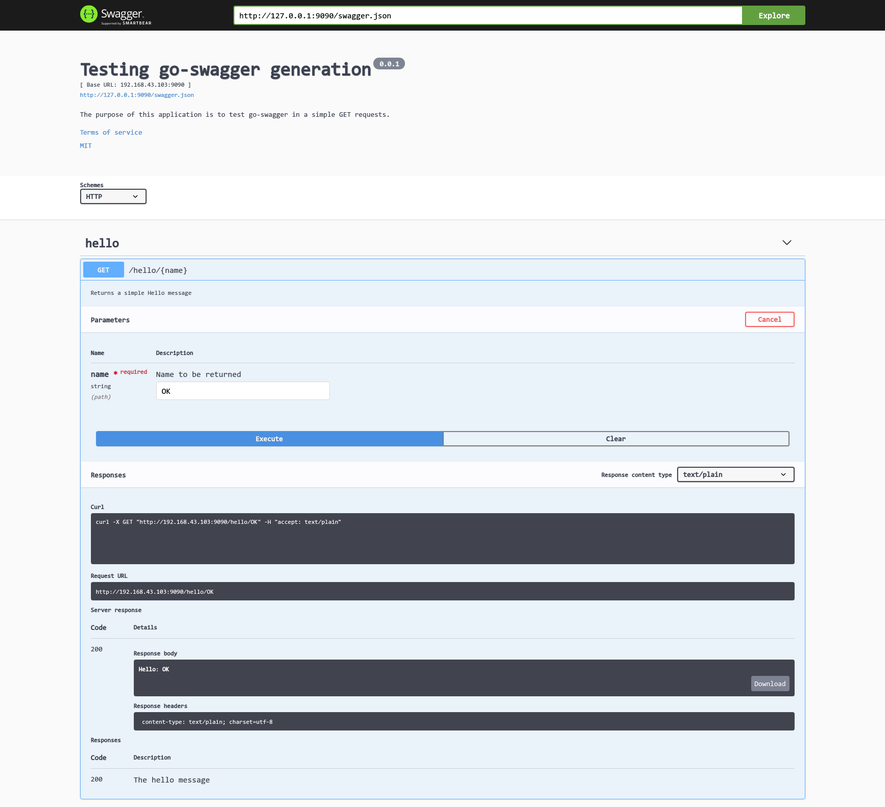

# Golang结合Swagger实现REST API文档自动生成与功能测试

## 概述

swagger是一个规范和完整的用于生成, 描述, 调用和可视化RESTful风格WEB服务的框架, 通过在代码中加入遵循Swagger(OpenAPI)语义规范的描述性内容(注解或注解式注释), 可以自动生成可视化, 可测试的API文档, 实现规范化的API文档的同时, 降低了API测试的门槛, 也便于与其他系统进行便捷集成.
当然swagger的功能不仅如此, 但目前而言这一功能比较实用, 在java spring boot中通过注解特性很好的集成了swagger的自动化文档和功能测试. 针对golang项目, 则需要单独的解决方案, 本文档将通过一个简单的例子演示golang项目中如何结合swagger实现REST API文档的自动生成与功能测试.

## 前置

### golang

安装golang并配置环境变量

### go-swagger

安装go-swagger库, 提供swagger.yml(swagger.json)文件自动生成

```bash
go get -u -v github.com/go-swagger/go-swagger/cmd/swagger
```

### swagger-ui

通过容器化swagger-ui结合swagger.json提供REST API测试服务

```bash
docker pull swaggerapi/swagger-ui
```

### gorilla/mux

golang下简洁强大的路由库, 结合golang的http标准库, 实现golang REST API的开发

```bash
go get -u -v github.com/gorilla/mux
```

### rs/cors

与golang的http标准库结合, 实现方便的cors定制, 解决跨域问题

```bash
go get -u -v github.com/rs/cors
```

## 示例

本示例首先编写常规代码实现一个简单的REST API, 然后遵循swagger语法在已有代码基础上添加相关注释, 根据注释和源代码生成swagger.json文件, 最后启动swagger-ui容器, 加载swagger.json文件, 实现可视化文档生成和项目功能测试.

#### 新建golang项目

```bash
mkdir ./swago
cd ./swago
```

#### 编写功能代码

本示例仅编写一个main.go文件的简单功能代码, 但事实上swagger支持自动探测自main函数以下所有被调用的文件中的swagger注释.

```go
package main

import (
	"fmt"
	"log"
	"net/http"

	"github.com/gorilla/mux"
	"github.com/rs/cors"
)

func main() {
	router := mux.NewRouter().StrictSlash(true)                  // 实例化路由
	router.HandleFunc("/hello/{name}", index).Methods("GET")     // 功能API
	router.HandleFunc("/swagger.json", swagger).Methods("GET")   // 支持swagger.json在swagger-ui中的加载

    handler := cors.Default().Handler(router)                    // 解决跨域问题

	log.Fatal(http.ListenAndServe(":9090", handler))             // 启动服务

}

func index(w http.ResponseWriter, r *http.Request) {             // /hello/{name}路由请求的handler
	log.Println("Responsing to /hello request")
	log.Println(r.UserAgent())

	vars := mux.Vars(r)
	name := vars["name"]

	w.WriteHeader(http.StatusOK)
	fmt.Fprintln(w, "Hello:", name)
}

func swagger(w http.ResponseWriter, r *http.Request) {           // 提供swagger.json的远程请求
	w.Header().Set("Content-Type", "application/json")
	http.ServeFile(w, r, "swagger.json")
}
```

#### 添加swagger注释

分别在main.go文件头部和API handler内添加相应的符合swagger规范的注释内容, 最终的文件如下:

```go
// Package main Testing go-swagger generation
//
// The purpose of this application is to test go-swagger in a simple GET requests.
//
// Schemes: http
// Host: 192.168.43.103:9090
// Version: 0.0.1
// License: MIT http://opensource.org/licenses/MIT
// Contract: xshrim<xshrim@gmail.com>
// Terms Of Service:
// there are no TOS at this moment.
//
// Consumes:
// - text/plain
//
// Produces:
// - text/plain
//
// swagger:meta
package main

import (
	"fmt"
	"log"
	"net/http"

	"github.com/gorilla/mux"
	"github.com/rs/cors"
)

func main() {
	router := mux.NewRouter().StrictSlash(true)
	router.HandleFunc("/hello/{name}", index).Methods("GET")
	router.HandleFunc("/swagger.json", swagger).Methods("GET")

	handler := cors.Default().Handler(router)

	log.Fatal(http.ListenAndServe(":9090", handler))

}

func index(w http.ResponseWriter, r *http.Request) {
	// swagger:operation GET /hello/{name} hello Hello
	//
	// Returns a simple Hello message
	// ---
	// consumes:
	// - text/plain
	// produces:
	// - text/plain
	// parameters:
	// - name: name
	//   in: path
	//   description: Name to be returned
	//   required: true
	//   type: string
	// responses:
	//   200:
	//     description: The hello message
	//     type: string
	log.Println("Responsing to /hello request")
	log.Println(r.UserAgent())

	vars := mux.Vars(r)
	name := vars["name"]

	w.WriteHeader(http.StatusOK)
	fmt.Fprintln(w, "Hello:", name)
}

func swagger(w http.ResponseWriter, r *http.Request) {
	w.Header().Set("Content-Type", "application/json")
	http.ServeFile(w, r, "swagger.json")
}
```

#### 通过go-swagger提供的swagger工具生成swagger.json文件

```bash
swagger generate spec -o ./swagger.json
```

需要注意的是, 对于使用swagger:model标记的struct, 只有当struct在paramsorresponse等结构中被使用到时, generate spec时才会被加入definitions中, 否则如果需要将所有struct均自动加入definitions中, 则需要使用以下命令进行生成:

```bash
swagger generate spec -mo ./swagger.json
```

但很多时候只想部分struct被解析, 则要在不需要解析的struct上以swagger:ignore进行注解.

#### 启动REST服务

```bash
go run main.go
```

#### 启动swagger-ui容器

```bash
docker run -it -e API_URL=http://192.168.43.103:9090/swagger.json -p 8081:8080 swaggerapi/swagger-ui   # 指定API_URL后无需手动填写swagger.json访问链接, 除json外也支持yaml文件
```

#### swagger-ui中加载swagger.json文件

浏览器中访问http://192.168.43.103:8081/打开swagger-ui, 在Explore栏中填入本项目的swagger.json的访问链接http://192.168.43.103:9090/swagger.json, 即可完成可视化文档的生成与API功能调试.



## 注

### makefile

可以制作makefile自动完成swagger.json文件的生成, REST服务, swagger-ui的启动和swagger.json文件的加载

```makefile
swagger-spec:
	go get -u github.com/go-swagger/go-swagger/cmd/swagger
	swagger generate spec -o ./swagger.json
run:
	go run main.go
swagger-ui:
	docker run --rm -it -e API_URL=http://192.168.43.103:9090/swagger.json -p 8081:8080 swaggerapi/swagger-ui
```

运行命令

```bash
# 终端1
make swagger-spec
make run
# 终端2
make swagger-ui
```

### model

关于swagger:model的解析问题, 上文已作简要说明, 下面以单独的例子进行解释.

如以下源码和swagger注解:

```go
// go-swagger examples.
//
// The purpose of this application is to provide some
// use cases describing how to generate docs for your API
//
//     Schemes: http, https
//     Host: localhost
//     BasePath: /
//     Version: 0.0.1
//
//     Consumes:
//     - application/json
//
//     Produces:
//     - application/json
//
// swagger:meta
package main

import "net/http"

// An OrderBodyParams model.
//
// This is used for operations that want an Order as body of the request
// swagger:parameters createOrder
type OrderBodyParams struct {
	// The order to submit.
	//
	// in: body
	Order *Order `json:"order"`
}

// An Order for one or more products by a user.
// swagger:model order
type Order struct {
	// ID of the order
	//
	// required: true
	ID int64 `json:"id"`

	// the id of the user who placed the order.
	//
	// required: true
	UserID int64 `json:"user_id"`

	// items for this order
	// mininum items: 1
	OrderItems []struct {

		// the id of the product to order
		//
		// required: true
		ProductID int64 `json:"product_id"`

		// the quantity of this product to order
		//
		// required: true
		// minimum: 1
		Quantity int32 `json:"qty"`
	} `json:"items"`
}

// An OrderResponse response model
//
// This is used for returning a response with a single order as body
//
// swagger:response orderResponse
type OrderResponse struct {
	//Get number of rate limted requests remaining
	//
	RateLimitRemaining string `json:"Rate-Limit-Remaining"`
}

// CreateOrder swagger:route POST /orders orders createOrder
//
// Handler to create an order.
//
// Responses:
//        200: orderResponse
//        422: validationError
func CreateOrder(w http.ResponseWriter, req *http.Request) {
	// your code here
}
```

代码中使用swagger:model进行注解的Order struct在使用命令:

```bash
swagger generate spec -o ./swagger.json
```

生成spec的时候, order会被加入definitions中, 因为Order struct在OrderBodyParams (swagger:parameters)或OrderResponse (swagger:response) struct中被明确引用了.

如果去掉OrderBodyParams struct及其注解(或者只去掉该struct上的swagger:parameters注解), 由于没有任何struct直接引用Order struct, 即便Orderer struct上添加了swagger:model注解, 生成spec时该struct也不会被加入definitions中.

但如果在此基础上, 使用命令:

```bash
swagger generate spec -mo ./swagger.json    # or swagger generate spec -m -o ./swagger.json
```

生成spec时, 则无论struct是否添加了swagger:model注解, 也无论某个struct是否被其他注解的struct引用, 所有struct都会被添加到definitions中(包括使用了其他swagger注解的struct), 只有添加了swagger:ignore注解的struct不会被添加.

### spec

golang中swagger注释规范文档: https://goswagger.io/generate/spec.html
