<style scoped>span { color: #bb7; }</style>
<style scoped> { color: #abc; }</style>
# <!-- fit --> 可观察性 - 指标监控

<br>
<br>

### &nbsp; &nbsp;  &nbsp; &nbsp; &nbsp; &nbsp; &nbsp; &nbsp; &nbsp; &nbsp; &nbsp; &nbsp; &nbsp; &nbsp; &nbsp; &nbsp; &nbsp; &nbsp; &nbsp; &nbsp; &nbsp; &nbsp;  &nbsp; &nbsp; &nbsp; &nbsp; &nbsp; &nbsp; &nbsp; &nbsp; &nbsp; &nbsp; &nbsp; &nbsp; &nbsp; &nbsp; &nbsp; &nbsp; &nbsp; &nbsp; &nbsp; 智能云计算 &nbsp; 陈盼

### &nbsp; &nbsp;  &nbsp; &nbsp; &nbsp; &nbsp; &nbsp; &nbsp; &nbsp; &nbsp; &nbsp; &nbsp; &nbsp; &nbsp; &nbsp; &nbsp; &nbsp; &nbsp; &nbsp; &nbsp; &nbsp; &nbsp;  &nbsp; &nbsp; &nbsp; &nbsp; &nbsp; &nbsp; &nbsp; &nbsp; &nbsp; &nbsp; &nbsp; &nbsp; &nbsp; &nbsp; &nbsp; &nbsp; &nbsp; &nbsp; &nbsp; &nbsp; &nbsp; &nbsp; &nbsp; &nbsp; 2020.07.17

---

# **可观察性** - [理念](https://codertw.com/%E7%A8%8B%E5%BC%8F%E8%AA%9E%E8%A8%80/646163/)

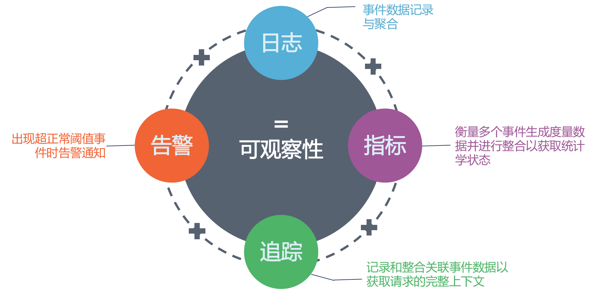

###### 融合运维与研发主动观测和分析应用与系统各项数据关联以全方位掌控其状态的理念

---

# **可观察性** - [三大支柱](https://www.infoq.cn/article/observability-enhance)


---

# **可观察性** - [优缺点](https://zhuanlan.zhihu.com/p/145573370)

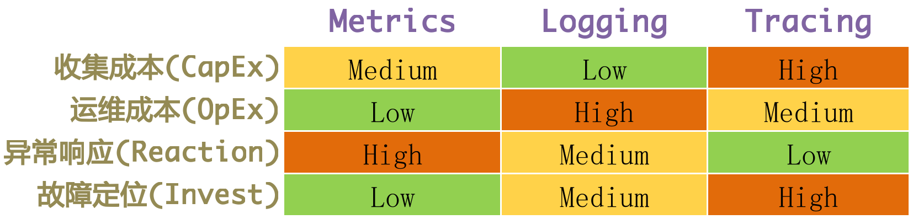

---

# **可观察性** - [Elastic Stack](https://www.elastic.co/cn/blog/observability-with-the-elastic-stack)

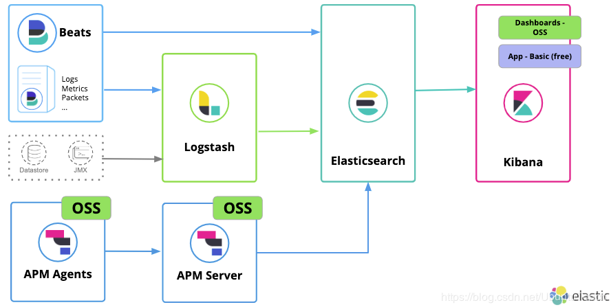 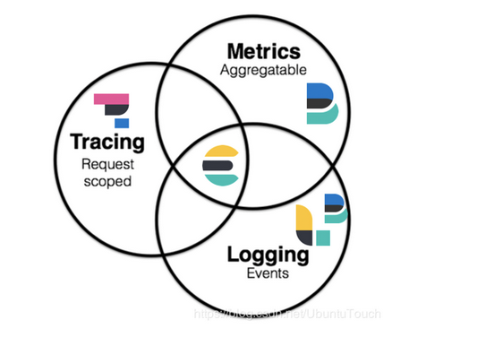

---

# **可观察性** - [GrafanaLabs](https://grafana.com/blog/2019/10/21/whats-next-for-observability/)

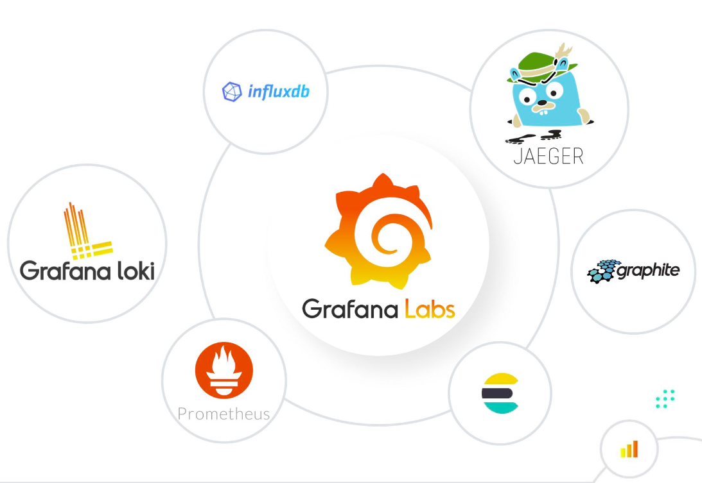

---

# **可观察性** - [Skywalking](https://www.sofastack.tech/blog/service-mesh-virtual-meetup1-skywalking-observability-applications/)

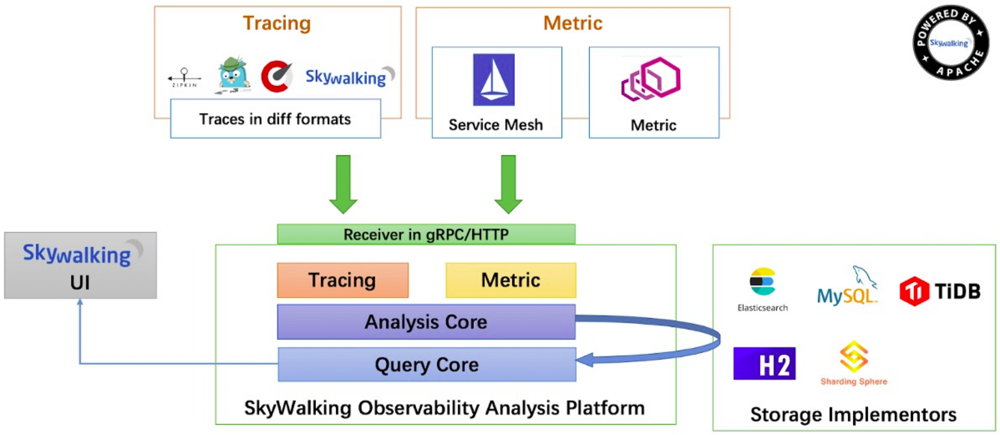

---

# **可观察性** - [Istio](https://istio.io/latest/zh/docs/concepts/observability/)

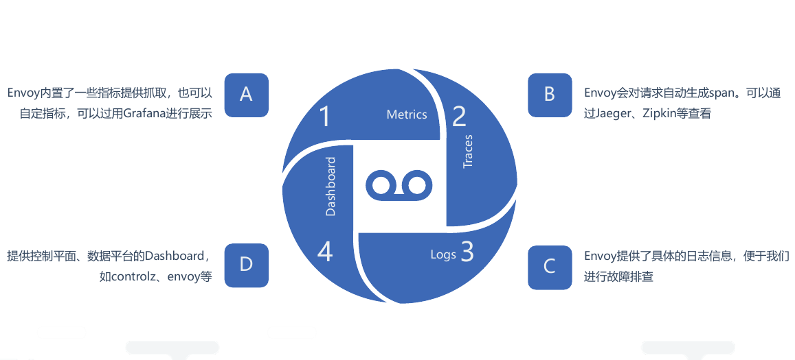

---

# **可观察性** - [排障流程](https://www.infoq.cn/article/thfsXOQwv0lL*5UDAkjF)

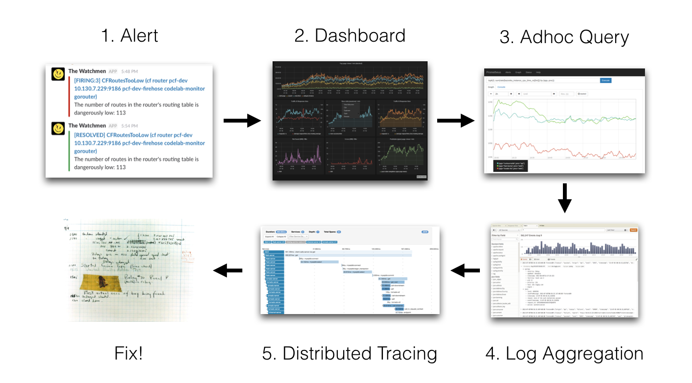

---

# **可观察性** - [标准协议](https://developer.aliyun.com/article/766070)

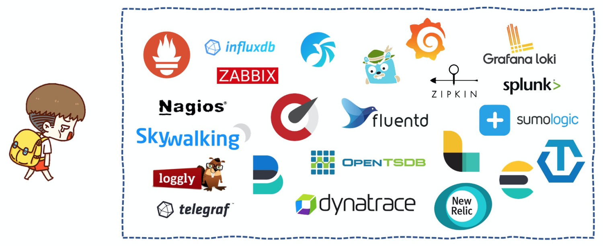
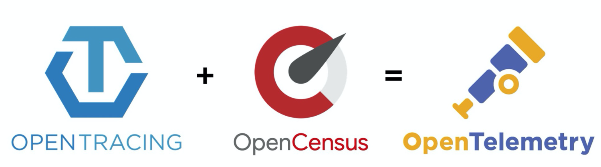

---

# **可观察性** - [OpenTelemetry](https://blog.thundra.io/what-is-opentelemetry-and-what-does-it-bring)

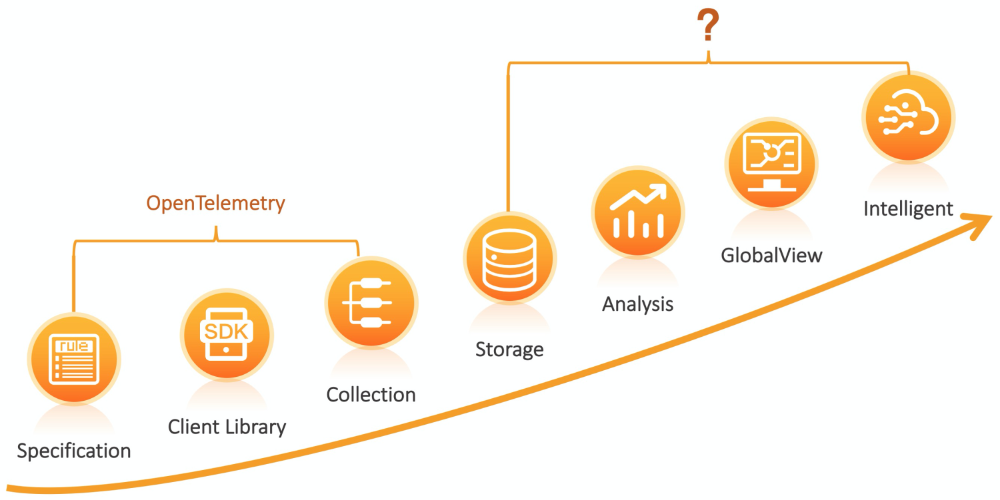


---

# **指标度量** - [指标&时序](https://www.infoq.cn/article/monitoring-SRE-golden-signals)

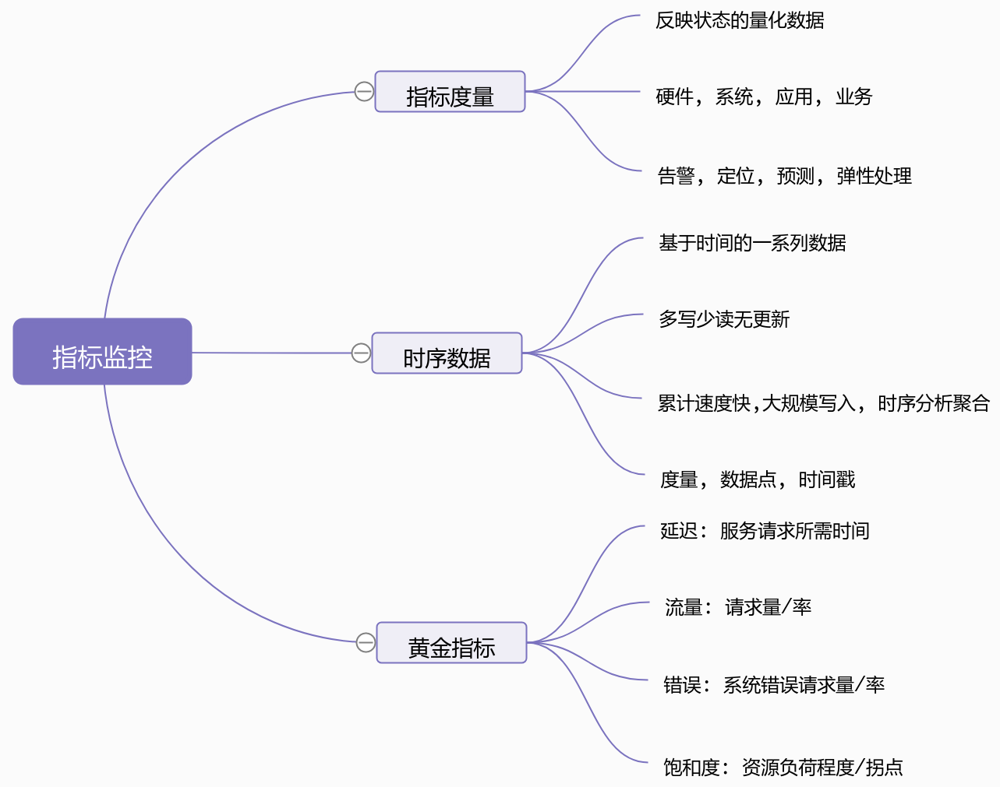

---

# **指标度量** - [类型&模型](https://prometheus.io/docs/concepts/data_model/)

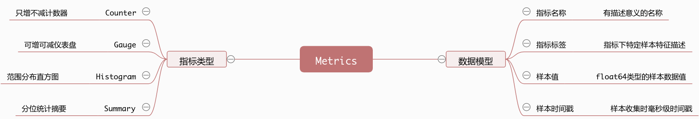

```bash
<--------------- metric ---------------------><-timestamp -><-value->
http_request_total{status="200", method="GET"}@1434417560938 => 94355  # time series

http_request_total{status="200", method="GET"} 94355  # Counter

go_goroutines{instance="172.17.0.1:2222",job="prometheus"} 8 # Gauge

http_requests_latency_seconds_histogram_bucket{path="/",method="GET",code="200",le="10.0"} 2.0 # Histogram

http_requests_latency_seconds_summary{path="/",method="GET",code="200",quantile="0.9"} 8.1 # Summary

# Histogram数据分桶, 带le标签, Summary数据带quantile标签. 二者均带sum和count数据.
# Histogram数据可以在server端通过quantile操作计算分位数, Summary是在客户端计算好的.
# Counter, Gauge和Histogram在客户端是无锁统计的, Summary是有锁的.
```

---

# **指标监控** - [Exporter](https://yunlzheng.gitbook.io/prometheus-book/part-ii-prometheus-jin-jie/exporter/what-is-prometheus-exporter)

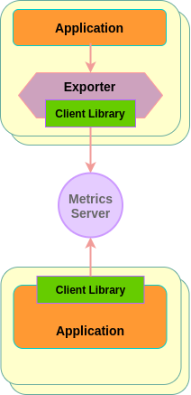

```go
package main

// import ...

var (
  opsProcessed = promauto.NewCounter(prometheus.CounterOpts{
    Name: "myapp_processed_ops_total",
    Help: "The total number of processed events",
  })
)

func recordMetrics() {
  go func() {
    for {
      opsProcessed.Inc()
      time.Sleep(2 * time.Second)
    }
  }()
}

func main() {
  recordMetrics()

  http.Handle("/metrics", promhttp.Handler())
  http.ListenAndServe(":2222", nil)
}
```

```go
# HELP myapp_processed_ops_total The total number of processed events  
# TYPE myapp_processed_ops_total counter  
myapp_processed_ops_total 2  

// # HELP <metric_name> <doc_string>
// # TYPE <metric_name> <metric_type>
// le和quantile递增排序
```

---

# **指标监控** - [Prometheus](http://www.yunweipai.com/34713.html)

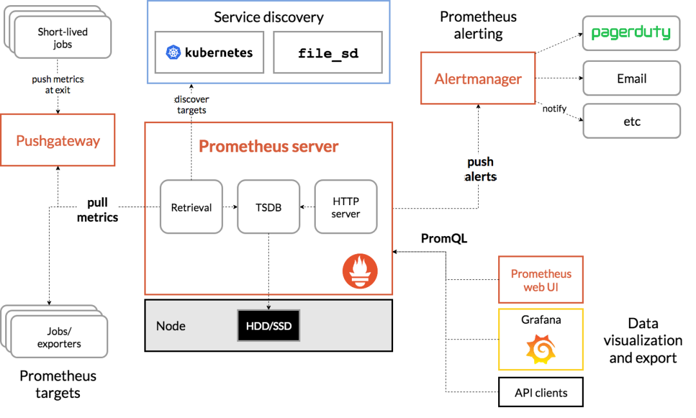

---

# **指标监控** - [Prometheus高可用](https://zhuanlan.zhihu.com/p/86763004)


---

# **指标监控** - [Thanos](https://k8s.imroc.io/monitoring/build-cloud-native-large-scale-distributed-monitoring-system/thanos-arch/)


---

# **Prometheus** - [PromQL](https://prometheus.io/docs/prometheus/latest/querying/basics/)

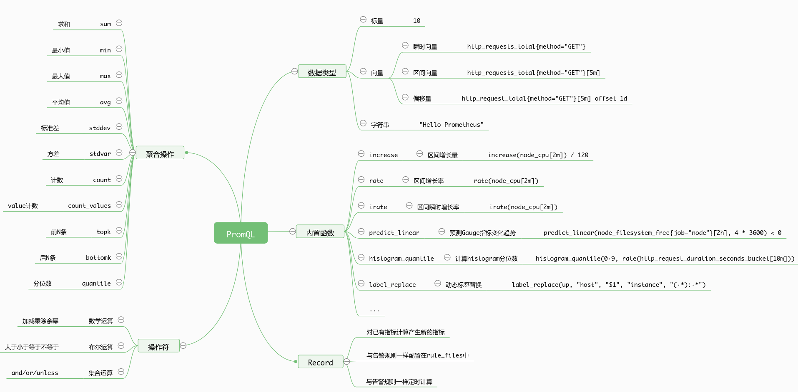

---

# <font size=6>**Prometheus** - [服务发现](https://prometheus.io/docs/prometheus/latest/configuration/configuration/#scrape_config)</font>


```yaml
global:
  # 默认指标抓取间隔
  [ scrape_interval: <duration> | default = 1m ]

  # 指标抓取超时时间
  [ scrape_timeout: <duration> | default = 10s ]

  # 告警规则计算周期
  [ evaluation_interval: <duration> | default = 1m ]

  # 当Prometheus和外部系统(联邦, 远程存储, Alertmanager)通信时，添加标签到任意的时间序列或告警
  external_labels:
    [ <labelname>: <labelvalue> ... ]

  # PromQL查询日志保存文件
  [ query_log_file: <string> ]

# 规则(alert, record)文件列表
rule_files:
  [ - <filepath_glob> ... ]

# 指标抓取配置
scrape_configs:
  [ - <scrape_config> ... ] # job中可配置relabel_configs和metric_relabel_configs

# 告警配置
alerting:
  alert_relabel_configs:
    [ - <relabel_config> ... ]
  alertmanagers:
    [ - <alertmanager_config> ... ]

# 指标数据远程写入相关配置
remote_write:
  [ - <remote_write> ... ]

# 指标数据远程读取相关配置
remote_read:
  [ - <remote_read> ... ]
```

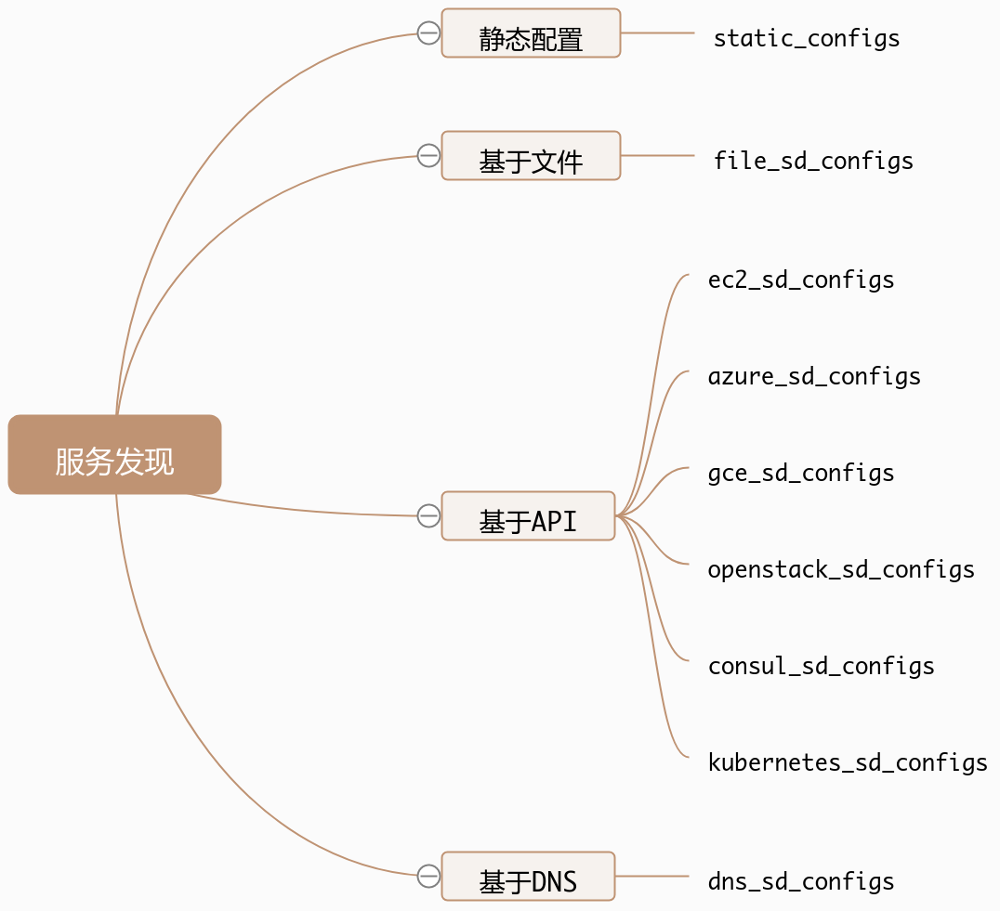

---

# **Prometheus** - [Operator](https://www.jishuwen.com/d/2oMJ/zh-tw)

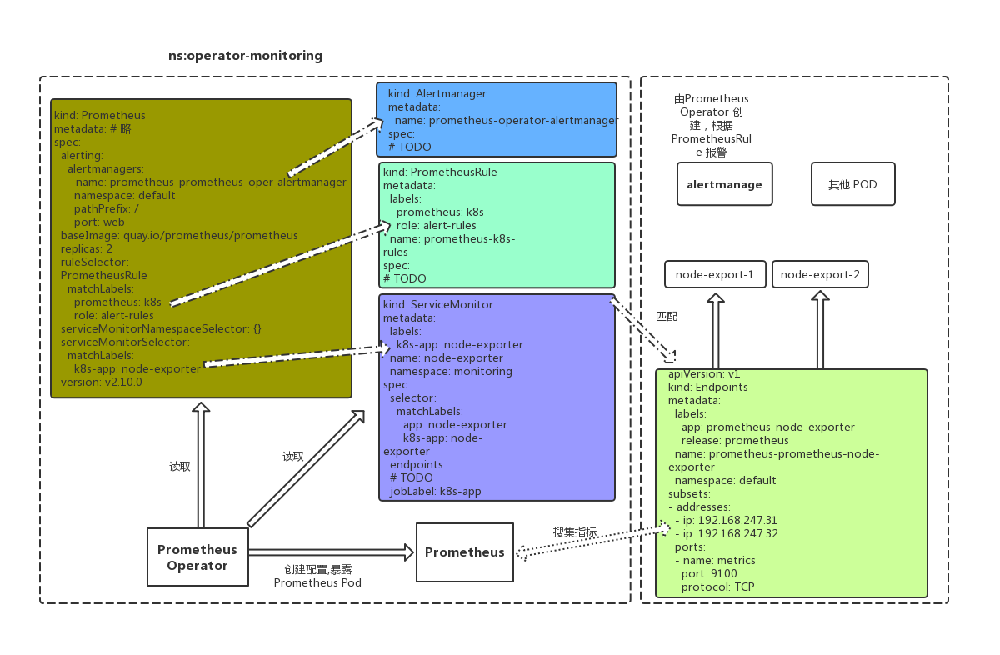
