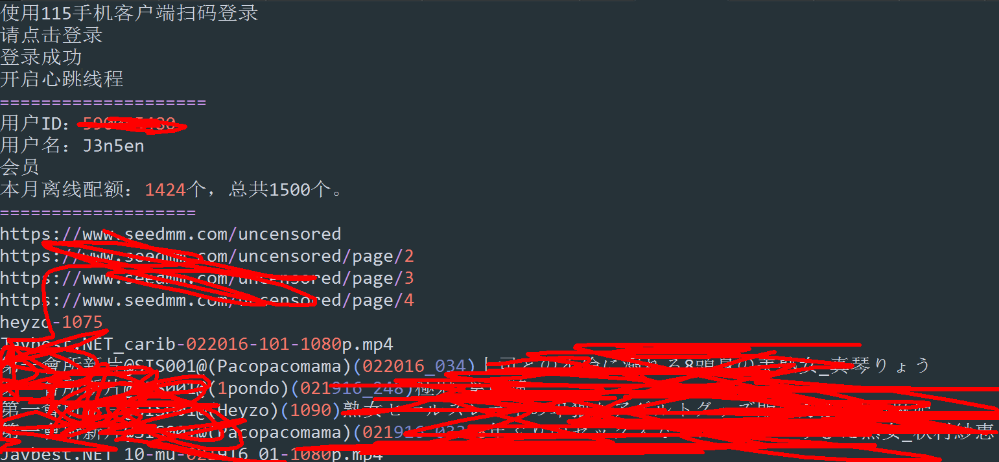
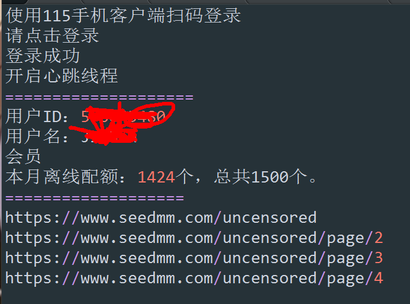

# 115API

环境 python >= 2.7.9 依赖 pyquery、requests
2016/03/23 更新批量种子离线下载

在舍友的要求下更新批量种子离线下载

使用方法：把种子放在`torrents` 下，在`main()` 后调用`add_many_bt()` 

ps:`upload_torrent()` 是提交一个种子离线下载

​	

---

网页版115云盘API，暂时能登陆，和新建离线任务。


## 115 API Pipeline

---

```
 +------------+
 |            |                   +--------------+
 | getInfos   |                   |              |
 |            |                   | getUserinfo  |
 +----+-------+                   |              |
      |                           +------+-------+            +------------+
      |                                  ^                    |            |
      |                                  |                    |            |
+-----v-------+                   +------+-------+      +-----+------+     |
|             |                   |              |      |            |     |
|  getQrcode  +-- waitLogin------>+     login    +----> |  keepLogin | <---+
|             |        ^          |              |      |            |
+-----+-------+        |          +-------+------+      +------------+
      |                |                  |
      |                |                  |
      v                |                  |
QRCode Scaned +--------+                  |
                                          |
            +---------------+     +-------v-----+     +--------------+
            |               |     |             |     |              |
            | addLinktasks  +<----+ getTasksign +---->+ addLinktask  |
            |               |     |             |     |              |
            +---------------+     +-------------+     +--------------+
```

## Demo

---

`example.py` 文件可以作为使用参考例子。(批量添加Javbus的推荐)

先调用`f115api.main() ` 使得账号处于登陆状态。
使用`addLinktask()` 可以添加单条任务
    `f115api.addLinktask("magnet:?xt=urn:btih:XXXXX")`
    可以是HTTP、HTTPS、FTP、磁力链或电驴链接
使用`addLinktasks()`可以添加多条任务
    `f115api.addLinktasks(list)`
    其中list是列表链接列表。



## 有什么卵用
-   批量下载片片
-   可以做一个老司机发车网，扫码即上车。
-   。。。
